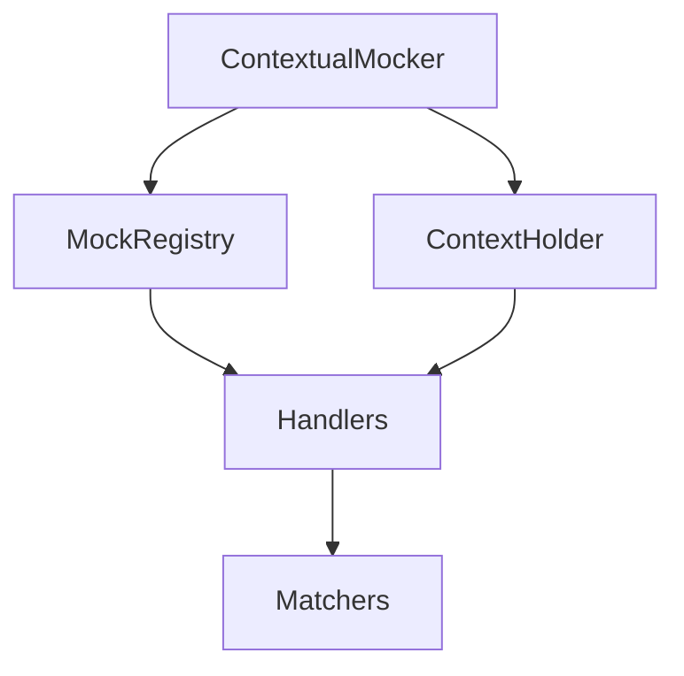

# ContextualMocker Engineer Onboarding Guide

Welcome to the ContextualMocker project! This guide is designed to help new engineers quickly become productive contributors. It provides a comprehensive overview of the project, its architecture, development environment setup, key libraries and patterns, contribution process, testing strategy, debugging tips, and the core design philosophies that guide our work.

---

## Table of Contents

1. [Project Overview](#project-overview)
2. [Architecture](#architecture)
3. [Development Environment Setup](#development-environment-setup)
4. [Key Libraries & Patterns](#key-libraries--patterns)
5. [Contribution Guidelines](#contribution-guidelines)
6. [Testing Procedures](#testing-procedures)
7. [Debugging Tips](#debugging-tips)
8. [Core Design Philosophies](#core-design-philosophies)
9. [Further Reading](#further-reading)

----

## Project Overview

**ContextualMocker** is a powerful Java mocking framework designed to enable context-aware, thread-safe, and highly flexible mocking for complex test scenarios. Its unique approach allows for the isolation of mock behaviors and verifications within distinct execution contexts, making it ideal for concurrent and stateful testing environments.

**Key Goals:**
- Provide robust context isolation for mocks.
- Support advanced verification and stubbing patterns.
- Ensure thread safety and high performance.
- Offer an intuitive API for developers.

**What Makes ContextualMocker Unique:**
- Context propagation and isolation at the core.
- Fine-grained control over mock behavior per context.
- Designed for modern, concurrent Java applications.

---

## Architecture

ContextualMocker is built around several core components, each with a specific responsibility. The architecture emphasizes modularity, extensibility, and clear separation of concerns.

### Core Components

- **ContextualMocker**: The main entry point for creating and managing mocks within specific contexts.
- **MockRegistry**: Maintains a registry of all active mocks, mapping them to their respective contexts.
- **ContextHolder**: Manages the current execution context, enabling context propagation and isolation.
- **Handlers**: Intercept method invocations on mocks, delegating to the appropriate logic based on context (e.g., `ContextualInvocationHandler`, `VerificationMethodCaptureHandler`).
- **Matchers**: Provide flexible argument matching for stubbing and verification (e.g., `AnyMatcher`, `EqMatcher`, `ArgumentMatchers`).

### Component Interactions



- **ContextualMocker** coordinates the creation and management of mocks, delegating to **MockRegistry** and **ContextHolder**.
- **MockRegistry** keeps track of all mocks and their associated contexts.
- **ContextHolder** ensures that the correct context is active during mock interactions.
- **Handlers** intercept method calls and route them according to the current context.
- **Matchers** are used by handlers to determine if method arguments match stubbing or verification rules.

> For a deeper technical dive, see [docs/DESIGN.md](./DESIGN.md).

---

## Development Environment Setup

Follow these steps to set up your local development environment for ContextualMocker:

### 1. Prerequisites

- **Java Development Kit (JDK):** Version 17 or higher is required.
- **Maven:** Version 3.6+ is recommended.
- **Git:** For version control.

### 2. Clone the Repository

```sh
git clone https://github.com/your-org/contextual-mocker.git
cd contextual-mocker
```

### 3. Import into Your IDE

- **IntelliJ IDEA:**
  - Open the project as a Maven project.
  - Enable annotation processing (`Preferences > Build, Execution, Deployment > Compiler > Annotation Processors`).
  - Use the default code style or import the provided `.editorconfig` if available.
- **Eclipse:**
  - Import as an existing Maven project.
  - Ensure JDK 17+ is configured.
  - Enable annotation processing in project properties.

### 4. Build the Project

```sh
mvn clean install
```

### 5. Code Style

- Follow the [Google Java Style Guide](https://google.github.io/styleguide/javaguide.html) unless otherwise specified.
- Use spaces for indentation (4 spaces per level).
- Keep lines under 120 characters.

---

## Key Libraries & Patterns

### Core Dependencies

- **SLF4J / Logback:** Used for logging throughout the project. See `src/main/resources/logback.xml` for configuration.
- **Mockito Core:** Used internally for certain mocking operations (if present).
- **JUnit 5:** The primary testing framework.
- **Maven:** For build and dependency management.

### Design Patterns

- **Dependency Injection:** Used to decouple components and facilitate testing.
- **Context Propagation:** Ensures that mocks behave according to the active context.
- **Handler Pattern:** Invocation handlers manage method calls on mocks.
- **Registry Pattern:** Centralized management of mocks and their contexts.

---

## Contribution Guidelines

We welcome contributions! Please follow these steps to ensure a smooth process:

### 1. Fork and Branch

- Fork the repository on GitHub.
- Create a feature branch from `main`:
  ```sh
  git checkout -b feature/your-feature-name
  ```

### 2. Coding Standards

- Adhere to the project's code style (see above).
- Write clear, concise, and well-documented code.
- Include unit and integration tests for new features.

### 3. Commit Messages

- Use [Conventional Commits](https://www.conventionalcommits.org/) for all commit messages.
  - Example: `feat(context): add support for context-specific stubbing`
- Reference related issues in your commits when applicable.

### 4. Pull Requests

- Ensure your branch is up to date with `main`.
- Open a pull request with a clear description of your changes.
- Link to relevant issues and documentation.
- Be responsive to code review feedback.

---

## Testing Procedures

### Testing Strategy

- **Unit Tests:** Located in `src/test/java/com/contextualmocker/`. Cover individual components and logic.
- **Integration Tests:** Validate interactions between components and real-world scenarios.
- **Test Coverage:** Aim for high coverage, especially for core logic and edge cases.

### Running Tests

```sh
mvn test
```

- All tests should pass before submitting a pull request.
- Use descriptive test names and structure tests for readability.

### Test Philosophy

- Tests should be deterministic and isolated.
- Mock external dependencies where possible.
- Prefer context-specific tests to validate isolation and concurrency.

---

## Debugging Tips

- **Enable Debug Logging:** Set the `CONTEXTUAL_MOCKER_DEBUG` environment variable to `true` to enable verbose debug output.
  ```sh
  export CONTEXTUAL_MOCKER_DEBUG=true
  ```
- **Common Pitfalls:**
  - Forgetting to set the correct context before interacting with mocks.
  - Not cleaning up contexts between tests, leading to state leakage.
  - Misconfigured logging can obscure important debug information.
- **Debugging Techniques:**
  - Use your IDE's debugger to step through handler logic.
  - Add temporary log statements for complex context interactions.
  - Review the logs in `target/` for detailed execution traces.

---

## Core Design Philosophies

- **Thread Safety:** All core components are designed to be thread-safe, enabling safe use in concurrent test scenarios.
- **Context Isolation:** Each test or execution context is fully isolated to prevent cross-contamination of mock state.
- **API Usability:** The API is designed to be intuitive and expressive, reducing boilerplate and cognitive load.
- **Performance:** Efficient data structures and minimal synchronization are used to ensure high performance, even under heavy concurrency.
- **Extensibility:** The architecture supports easy extension for new handler types, matchers, and context strategies.

---

## Further Reading

- [Project README](../readme.md)
- [Design Document](./DESIGN.md)
- [Implementation Plan](./IMPLEMENTATION_PLAN.md)
- [How It Works](./HOW_IT_WORKS.md)
- [Changelog](../CHANGELOG.md)

---

Welcome aboard! If you have any questions or suggestions for improving this guide, please open an issue or submit a pull request.